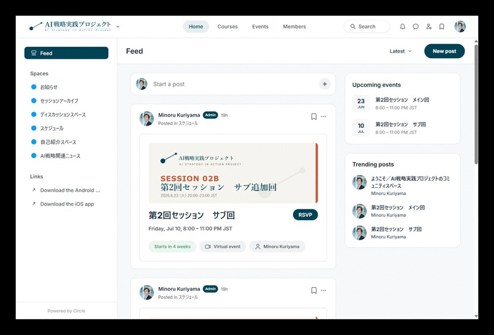

# 参加費と決済

本プロジェクトの参加費と、お申し込みから課金までの流れをまとめたページです。早期参加枠の
料金は、先に申し込まれた方ほど長くお得になる設計です。申込当月回の参加は無料で、翌月回の
参加から下記の参加費となります。

## 参加費（個人参加）

| プラン | 月額 | 対象 |
|---|---|---|
| **{{ pricing.early_label }}**（Stripe決済） | {{ pricing.early_monthly }}（**税込 {{ pricing.early_monthly_incl }}円**） | {{ pricing.early_target }} |
| 定価 | {{ pricing.list_monthly }}（税込 {{ pricing.list_monthly_incl }}円） | — |

!!! note "早期参加割引について"
    早期参加割引は、資料アーカイブなど運営体制の整備に伴い、早期に申し込まれた方の月額
    割引は当面維持しつつ、後から申し込む方の割引幅を段階的に縮小していく想定です。

## 決済方式

- クレジットカード等を利用できる **Stripe** での決済です（**カード情報は弊社で保持しません**）。
- **決済リンクは、ご登録いただいた方にメールでご案内します**（公開ページには掲載しません）。
  月ごとの参加コホートに応じて、初回決済日や限定クーポンなどを個別にご案内するためです。
- Stripe決済を完了された方を対象に、当月回のZoomリンク・資料等をご案内します。
- **申込当月回の参加は無料**、翌月回から課金が開始されます。
- **いつでもご自身で解約できます。** 申込後の当月回に参加後、翌月の課金発生日までに解約
  されれば費用は発生しません。
- インボイス番号付きの**適格請求書・領収書をPDFで取得**できます。勤務先等での経費処理に
  ご利用いただけます。

## 料金・課金のしくみ

お申し込みから課金開始までの流れと、早期参加枠のしくみを図でまとめました。文章だけでは
伝わりにくい2点を、下の図でご確認ください。

<figure markdown="span">
<svg viewBox="0 0 780 430" xmlns="http://www.w3.org/2000/svg" font-family="'Noto Sans JP', sans-serif" role="img" aria-label="お申し込みから課金までの流れ">
<rect x="0" y="0" width="780" height="430" fill="#FFFFFF"/>
<text x="40" y="50" font-family="'Noto Serif JP', serif" font-size="27" font-weight="700" fill="#004455">お申し込みから課金までの流れ</text>
<text x="41" y="79" font-size="14" fill="#5E7378">例：6月〜7月上旬にお申し込みの場合（第2回コホート）</text>
<rect x="39" y="104" width="168" height="104" rx="12" fill="#EAF1F2" stroke="#AEC6CA" stroke-width="1.5"/>
<text x="123" y="128" text-anchor="middle" font-size="11" letter-spacing="1.5" font-weight="700" fill="#1C6E7C">STEP 1</text>
<text x="123" y="154" text-anchor="middle" font-family="'Noto Serif JP', serif" font-size="20" font-weight="700" fill="#004455">お申し込み</text>
<text x="123" y="182" text-anchor="middle" font-size="12.5" fill="#003A47">Stripeに登録（登録は無料）</text>
<line x1="123" y1="208" x2="123" y2="252" stroke="#AEC6CA" stroke-width="1.5"/>
<rect x="219" y="104" width="168" height="104" rx="12" fill="#F5ECD3" stroke="#E0C77E" stroke-width="1.5"/>
<text x="303" y="128" text-anchor="middle" font-size="11" letter-spacing="1.5" font-weight="700" fill="#C0962F">STEP 2</text>
<text x="303" y="154" text-anchor="middle" font-family="'Noto Serif JP', serif" font-size="20" font-weight="700" fill="#004455">第2回に参加</text>
<text x="303" y="184" text-anchor="middle" font-family="'Noto Serif JP', serif" font-size="24" font-weight="700" fill="#C0962F">¥0 <tspan font-size="15">無料</tspan></text>
<line x1="303" y1="208" x2="303" y2="252" stroke="#E0C77E" stroke-width="1.5"/>
<rect x="397" y="104" width="168" height="104" rx="12" fill="#EAF1F2" stroke="#AEC6CA" stroke-width="1.5"/>
<text x="481" y="128" text-anchor="middle" font-size="11" letter-spacing="1.5" font-weight="700" fill="#1C6E7C">STEP 3</text>
<text x="481" y="154" text-anchor="middle" font-family="'Noto Serif JP', serif" font-size="20" font-weight="700" fill="#004455">初回の課金</text>
<text x="481" y="182" text-anchor="middle" font-size="12.5" fill="#003A47">¥5,940（早期割引 5,400＋税）</text>
<line x1="481" y1="208" x2="481" y2="252" stroke="#AEC6CA" stroke-width="1.5"/>
<rect x="575" y="104" width="168" height="104" rx="12" fill="#EAF1F2" stroke="#AEC6CA" stroke-width="1.5"/>
<text x="659" y="128" text-anchor="middle" font-size="11" letter-spacing="1.5" font-weight="700" fill="#1C6E7C">STEP 4</text>
<text x="659" y="154" text-anchor="middle" font-family="'Noto Serif JP', serif" font-size="20" font-weight="700" fill="#004455">以降の課金</text>
<text x="659" y="182" text-anchor="middle" font-size="12.5" fill="#003A47">毎月15日に自動更新</text>
<line x1="659" y1="208" x2="659" y2="252" stroke="#AEC6CA" stroke-width="1.5"/>
<text x="303" y="200" text-anchor="middle" font-size="11.5" fill="#5E7378">6/23 メイン・7/10 サブ</text>
<line x1="40" y1="252" x2="748" y2="252" stroke="#1C6E7C" stroke-width="2"/>
<polygon points="748,247 760,252 748,257" fill="#1C6E7C"/>
<circle cx="123" cy="252" r="6.5" fill="#004455" stroke="#FFFFFF" stroke-width="2"/>
<text x="123" y="276" text-anchor="middle" font-size="13" font-weight="700" fill="#004455">6月〜7月上旬</text>
<circle cx="303" cy="252" r="6.5" fill="#C0962F" stroke="#FFFFFF" stroke-width="2"/>
<text x="303" y="276" text-anchor="middle" font-size="13" font-weight="700" fill="#004455">6/23・7/10</text>
<circle cx="481" cy="252" r="6.5" fill="#004455" stroke="#FFFFFF" stroke-width="2"/>
<text x="481" y="276" text-anchor="middle" font-size="13" font-weight="700" fill="#004455">7/15</text>
<circle cx="659" cy="252" r="6.5" fill="#004455" stroke="#FFFFFF" stroke-width="2"/>
<text x="659" y="276" text-anchor="middle" font-size="13" font-weight="700" fill="#004455">毎月15日</text>
<rect x="40" y="300" width="708" height="86" rx="12" fill="#EAF1F2" stroke="#AEC6CA" stroke-width="1.5"/>
<rect x="40" y="300" width="6" height="86" rx="3" fill="#C0962F"/>
<text x="64" y="332" font-family="'Noto Serif JP', serif" font-size="17" font-weight="700" fill="#004455">解約はいつでも。課金日の前日までなら、その月は¥0。</text>
<text x="64" y="358" font-size="13.5" fill="#003A47">各課金日（毎月15日）の前日までに Stripe カスタマーポータルから解約すれば、その月の費用は発生しません。</text>
<text x="64" y="378" font-size="13.5" fill="#5E7378">例）7/14 までに解約 → 費用ゼロ。 ／ カード情報は弊社で保持しません。</text>
</svg>
<figcaption>図1：お申し込みから課金までの流れ（第2回コホートの例）</figcaption>
</figure>

<figure markdown="span">
<svg viewBox="0 0 780 482" xmlns="http://www.w3.org/2000/svg" font-family="'Noto Sans JP', sans-serif" role="img" aria-label="早期参加枠は申込時の月額が据え置き">
<rect x="0" y="0" width="780" height="482" fill="#FFFFFF"/>
<text x="40" y="50" font-family="'Noto Serif JP', serif" font-size="27" font-weight="700" fill="#004455">早く申し込むほど、ずっとお得</text>
<text x="41" y="78" font-size="13.5" fill="#5E7378">お申し込み時の月額は当面そのまま。後から参加する方ほど、割引は小さくなります。</text>
<line x1="158" y1="130" x2="748" y2="130" stroke="#D9E6E8" stroke-width="1"/>
<text x="146" y="134" text-anchor="end" font-size="13" fill="#5E7378">¥9,000（定価）</text>
<line x1="158" y1="188" x2="748" y2="188" stroke="#D9E6E8" stroke-width="1"/>
<text x="146" y="192" text-anchor="end" font-size="13" fill="#5E7378">¥8,100</text>
<line x1="158" y1="246" x2="748" y2="246" stroke="#D9E6E8" stroke-width="1"/>
<text x="146" y="250" text-anchor="end" font-size="13" fill="#5E7378">¥7,200</text>
<line x1="158" y1="304" x2="748" y2="304" stroke="#D9E6E8" stroke-width="1"/>
<text x="146" y="308" text-anchor="end" font-size="13" fill="#5E7378">¥6,300</text>
<line x1="158" y1="362" x2="748" y2="362" stroke="#D9E6E8" stroke-width="1"/>
<text x="146" y="366" text-anchor="end" font-size="13" fill="#5E7378">¥5,400</text>
<text x="40" y="108" font-size="12" fill="#5E7378">月額（税抜）</text>
<line x1="158" y1="418" x2="748" y2="418" stroke="#AEC6CA" stroke-width="1.5"/>
<polygon points="748,413 760,418 748,423" fill="#AEC6CA"/>
<text x="453.0" y="440" text-anchor="middle" font-size="12.5" fill="#5E7378">加入が進むほど（時期・幅は運営側で調整）→</text>
<path d="M 158 362 L 278 362 L 278 304 L 398 304 L 398 246 L 518 246 L 518 188 L 638 188 L 638 130 L 748 130" fill="none" stroke="#1C6E7C" stroke-width="2.2" stroke-dasharray="7 5" opacity="0.55" stroke-linejoin="round"/>
<line x1="398" y1="304" x2="748" y2="304" stroke="#1C6E7C" stroke-width="1.4" stroke-dasharray="3 4" opacity="0.4"/>
<text x="404" y="297" font-size="11" fill="#5E7378" opacity="0.9">今後の新規（例）</text>
<line x1="518" y1="246" x2="748" y2="246" stroke="#1C6E7C" stroke-width="1.4" stroke-dasharray="3 4" opacity="0.4"/>
<text x="524" y="239" font-size="11" fill="#5E7378" opacity="0.9">今後の新規（例）</text>
<line x1="638" y1="188" x2="748" y2="188" stroke="#1C6E7C" stroke-width="1.4" stroke-dasharray="3 4" opacity="0.4"/>
<text x="644" y="181" font-size="11" fill="#5E7378" opacity="0.9">今後の新規（例）</text>
<line x1="748" y1="130" x2="748" y2="130" stroke="#1C6E7C" stroke-width="1.4" stroke-dasharray="3 4" opacity="0.4"/>
<line x1="158" y1="362" x2="748" y2="362" stroke="#004455" stroke-width="3.4"/>
<circle cx="216" cy="362" r="7.5" fill="#C0962F" stroke="#FFFFFF" stroke-width="2"/>
<rect x="202" y="376" width="186" height="40" rx="9" fill="#F5ECD3" stroke="#E0C77E" stroke-width="1.3"/>
<text x="212" y="393" font-size="12" font-weight="700" fill="#C0962F">いまここ：第2回コホート</text>
<text x="212" y="410" font-size="11.5" fill="#003A47">当面 ¥5,400／月 のまま</text>
<text x="744" y="352" text-anchor="end" font-size="12.5" font-weight="700" fill="#004455">お申し込み済みの方は据え置き</text>
<line x1="158" y1="462" x2="190" y2="462" stroke="#004455" stroke-width="3.4"/>
<text x="196" y="466" font-size="11.5" fill="#003A47">お申し込み済みの方の月額（据え置き）</text>
<line x1="448" y1="462" x2="480" y2="462" stroke="#1C6E7C" stroke-width="2.2" stroke-dasharray="7 5" opacity="0.6"/>
<text x="486" y="466" font-size="11.5" fill="#003A47">今後の新規申込の想定（運営判断）</text>
</svg>
<figcaption>図2：早期参加枠は「申込時の月額が据え置き」になります。</figcaption>
</figure>

!!! note "3つのポイント"
    - **申込月の回は無料。** お申し込みいただいた当月のセッションは費用がかかりません。
    - **課金は翌15日から、毎月15日。** 初回課金は申込翌月の15日。以降は毎月15日が課金日です。
    - **前日までの解約で、その月は¥0。** 各15日の前日までにStripeカスタマーポータルから
      解約すれば費用は発生しません。解約はいつでもご自身で可能です。

早期参加枠の割引（{{ pricing.early_label }}：月額 {{ pricing.early_monthly }}）は、加入状況を
見ながら今後段階的に縮小していく想定です。先にお申し込みいただいた方の月額は当面据え置きます。
カード情報は弊社で保持しません。法人でのご利用・お見積りは
[support@antecanis.com](mailto:support@antecanis.com) までご相談ください。

## 参加者コミュニティ（Circle）

セッションは一度きりの講座ではありません。参加者向けコミュニティ（Circle）で、過去回の
アーカイブ、AI戦略関連ニュースの解説、参加者同士のディスカッションが続きます。AI時代の
戦略の引き出しを、継続して積み重ねる場です。

お知らせ・セッションアーカイブ・AI戦略関連ニュース・ディスカッションのスペースを用意して
います。ご参加（Stripe決済）の方に、Circleへの招待をメール／登録案内とあわせてお送りします。

## 法人でのご利用

一定人数以上でのご利用は、お見積書の発行・請求書払い・個別開催（費用別途）にも対応します。
詳しくは **[法人の方へ](corporate.md)** をご覧ください。

{{ footer_cta("[登録方法](register.md)", "[開催予定・次回案内](../sessions/schedule.md)", "[法人の方へ](corporate.md)") }}
