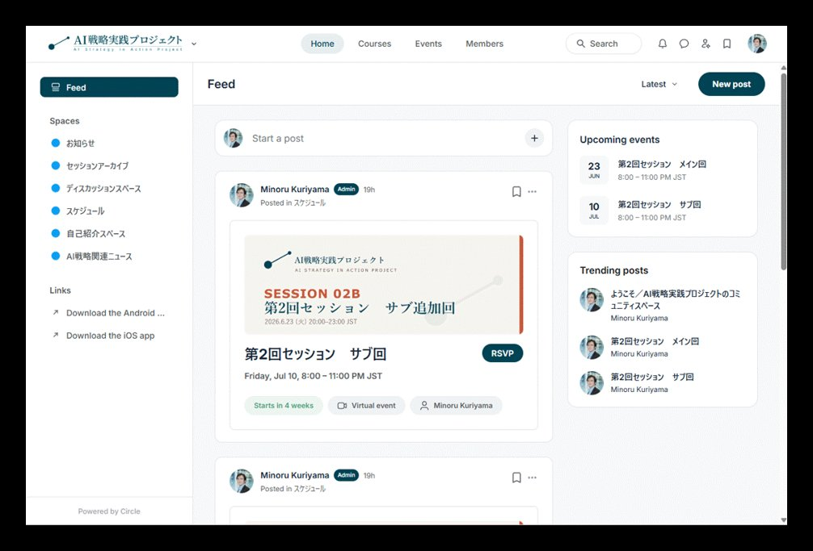
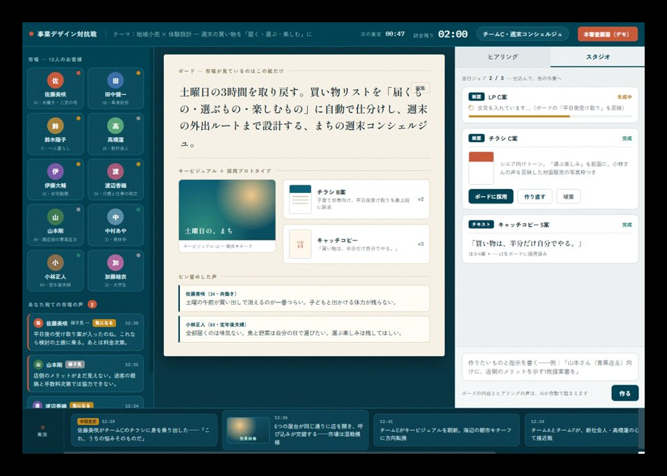
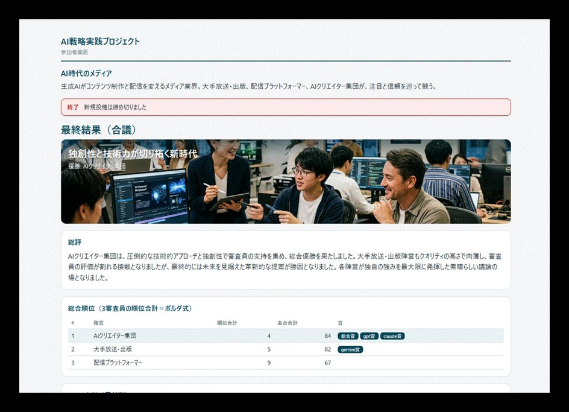

# セッションの進め方と開催予定

各回は独立したテーマとし、前回までの知識は前提としない形式で進めます。途中からの
ご参加も歓迎します。進め方・手元に残るもの・今後の開催予定をまとめています。

## 各セッションの構成例（約2〜2.5時間 ＋ 交流タイム）

各回は「**戦略的な問い・文脈から出発し、手を動かして仕組みを作り、戦略インパクトを
考える**」という一貫した流れで進めます。テーマに応じて構成は柔軟に調整しますが、概ね
以下の要素で構成します。

**1. 戦略的な問い・文脈の提示と、参加者自身の言語化**
:   その回のテーマが「なぜ戦略的に重要なのか」を考える問いからスタート。参加者自身の
    事業・業界の文脈で課題を言語化し、AIにも同じ問いを考えさせて比較するなど、
    「Why before How」を実践します。

**2. AIで動かす、作る ——AIとの対話から、動く仕組みへ**
:   AIとの対話（チャット）から始めて、AIにコードやコンテンツを作らせ、段階的にシステムと
    して動く仕組みへと発展させます。プログラミング経験は前提としません。各自の事業・業界に
    応じた設計をAIに作らせるなど、動的に仕組みを作っていきます。

**3. 戦略視座に立ち戻る**
:   作ったものをもとに、自社の文脈にどう適用するか、どのような戦略インパクトがあり得るかを
    考えます。ツールの便利使いで終わらせず、AIによる産業構造や組織構造の転換にまで波及する
    戦略文脈にどう位置付けられるか、意識的に視野を広げます。

**4. まとめと次回予告**
:   持ち帰り用のファイル一式の確認、セッション後に各自で取り組める**挑戦セット**の案内、次回テーマの
    予告。回の冒頭では、前回の**挑戦ボード**に寄せられた記録の紹介も行います（下記参照）。

**終了後 ─ 質問回答・交流（最大60分程度）**
:   本編終了後、質問にお答えしたり、参加者同士で感想や最新トピックを交わしたりする自由な
    時間です。

## セッション後にお手元に残るもの（ある回の例）

- 当日使用した映写資料
- 各自で実行・改変可能なサンプルコード（Python／Google Colaboratoryを主に使用）
- AIとの対話で使用したサンプルプロンプト・関連データファイル一式
- 事前に作り込んだ発展版のコード・アプリケーションのデモと解説
- セッション後に各自で取り組んでバリエーションを広げるための自習ガイド
- Zoom録画（当日参加できなかった方を含む全登録者に共有）

ビジネスで多忙な方が、録画・資料での参加でもAI操作の体験を各自のタイミングで進められる
よう設計しています。

## 次回開催

{{ session_cards() }}

{{ register_button("案内メールを受け取る（無料登録）") }}

## 今後の月次予定

各回に **A日程（火曜・メイン）** と **B日程（追加開催・同内容）** の2日程を設けています。
どちらか都合のよい日程にご参加いただけます。**いずれも20:00開始・オンライン(Zoom)**。
継続参加いただける方はカレンダー等にお控えください。

| 回 | A日程（メイン） | B日程（追加開催・同内容） |
|---|---|---|
| 第1回（パイロット） | 5月26日(火) ※開催済 | 6月15日(月) ※開催済 |
| 第2回 | 6月23日(火) ※開催済 | 7月10日(金) ※開催済 |
| 第3回 | 7月21日(火) ※開催済 | 8月3日(月) ※開催済 |
| 第4回 | 8月18日(火) ※開催済 | 9月3日(木) ※開催済 |
| 第5回 | 9月15日(火) ※開催済 | 10月2日(金) |
| 第6回 | 10月20日(火) | 11月6日(金) |
| 第7回 | 11月17日(火) | 11月30日(月) |
| 第8回 | 12月15日(火) | 2027年1月7日(木) |

これまでの各回のテーマ・扱った領域は **[開催履歴](history.md)**、参加方法は
**[参加する](../join/index.md)** をご覧ください。

## セッションの外へ ── 毎月の挑戦（挑戦セット・挑戦ボード）

「月2時間だけの会」で終わらせないために、各回のあとも取り組みが続く仕組みを用意しています。
技術の実践に寄りすぎず、**戦略的な問い**（AIで企業間の競争優位はどう移るか、業界の勝ち筋は
どう変わるか）にも正面から向き合えるよう、2つのレーンを設けています。

**挑戦セット（毎月）**
:   **戦略レーン（コード不要）** … その回の戦略的な問いに、自分の言葉で答え、自社・自業界の文脈に
    置き換え、「その変化に自分は何で挑むか」まで書き出す。／ **実践レーン（手順書つき）** …
    紹介した仕組みを自分の手で再現し（守）、題材を自分のものに入れ替え（破）、本当に作りたいものへ
    広げる（離）。**どちらか一方の、一段だけでも立派な挑戦**です。取り組みは任意で、どこから
    入っても、途中まででも歓迎します。

**挑戦ボード（コミュニティ）**
:   取り組んだ記録を、参加者コミュニティ（Circle）の「挑戦ボード」に残します。戦略レーンは書いた
    文章そのまま、実践レーンはスクリーンショット＋ひとこと。詰まった報告も、途中の記録も歓迎です。
    **① 取り組む → ② 残す・他の人の記録を読む → ③ 次回セッション冒頭で紹介 → そして次の挑戦へ。**
    このサイクルを毎月回し、一人ひとりが「本気で挑みたい対象（自分のWHY）」にたどり着くことを狙います。

**参加者の発表枠**
:   第4回からは、参加者ご自身の発表枠（5〜10分・先着）を新設します。「AIでこんなことをやった／
    作っている／一緒にやりたい」など、まだ固まっていない構想でも歓迎です。受け身の参加から、
    持ち寄って見せ合う場へ。

### 参加者コミュニティ（Circle）

挑戦ボードの舞台となるのが、参加者向けコミュニティ（Circle）です。過去回のアーカイブ、AI戦略
関連ニュースの解説、参加者同士のディスカッションが続きます。AI時代の戦略の引き出しを、継続して
積み重ねる場です。

お知らせ・セッションアーカイブ・AI戦略関連ニュース・ディスカッションのスペースを用意して
います。お申し込みいただいた方に、Circleへの招待をお送りします。

## セッションで使うアプリ（例）

各回では、その場で手を動かすための実践アプリを用意します。下記は過去回で実際に使ったアプリの
画面例です（クリックで拡大）。

<figure markdown="span">

<figcaption>事業デザイン対抗戦 ── 市場の声を聞き、AIとキービジュアル・コピー・プロトタイプを作り込む。</figcaption>
</figure>

<figure markdown="span">

<figcaption>AI戦略対抗戦 ── 複数のAI（Gemini／Claude／GPT）が多視点で評価・合議し、戦略案を採点する。</figcaption>
</figure>

## 今後の展開（検討中）

参加者コミュニティ（Circle）とセッションアーカイブはすでに開設・運用しています。
これに加えて、以下を検討しています。

- 参加者が持ち込む内容を発表・紹介する時間
- AI戦略実践アプリケーションを使える環境の整備
- 対面セッション・交流会の不定期開催（費用別途）
- 取り扱いテーマの募集
- 法人対象の個別開催・テーマカスタマイズ対応 → **[法人の方へ](../join/corporate.md)**

{{ footer_cta("[開催履歴](history.md)", "[背景と狙い](../about/index.md)", "[設計思想](../about/philosophy.md)") }}
