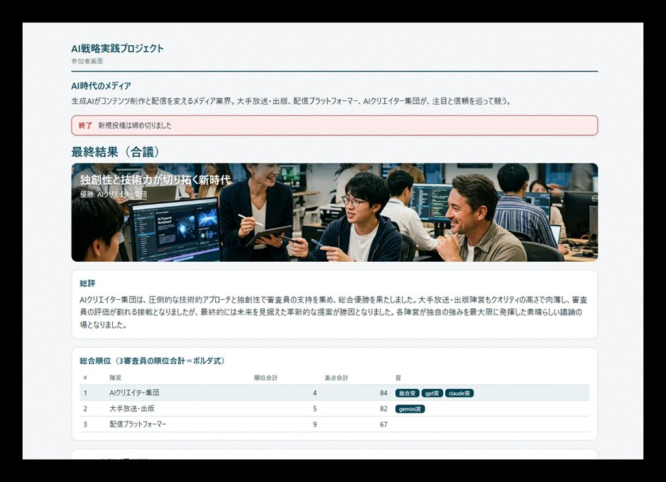

# 月次テーマ

各回は独立したテーマとし、前回までの知識は前提としない形式で進めます。途中からの
ご参加も歓迎します。AIの急速な進化に応じてテーマを常に更新し続けます。参加者の関心や
初回からのフィードバックも取り入れながら、毎回、戦略的視座で最も興味深い構成を試行錯誤で
改良していきます。

## 開催済みのテーマ

### 第2回（開催済）：AIと共に、戦略の大転換を考える ——競争のルールがAIで書き換わるとき

「AI時代の教育」を題材にしたAI戦略対抗戦と、地域小売を題材にしたAI事業デザインゲームの
2つを通じて、競争のルール（顧客価値・顧客接点・差別化資産）がAIでどう書き換わるかを体験。
戦略を「AIと共に、AIを前提に」描き直す、戦略転換レイヤーの回でした。

→ **[第2回ダイジェスト](../digests/vol-02.md)** で当日の流れをご覧いただけます。

### 第1回（パイロット・開催済）：人間の認知容量の解除 ——情報×AIの戦略インパクト

世界のビジネスニュースを題材に、「人間の認知容量の限界」が事業戦略上のボトルネックに
なっている場面を自ら言語化し、AIとの比較を通じて考え、情報取得から分析・可視化・自動
配信・アプリ化までを段階的に体験しました。「AIと対話する」から「AIを仕組みとして
組み込む」への転換を、一つのセッションの中で実感するパイロット回でした。

→ **[第1回ダイジェスト](../digests/index.md)** で当日の流れをご覧いただけます。

## 今後のテーマ領域（随時更新）

以下のような領域から、毎回、戦略的に最もインパクトの大きいテーマを選定・設計して提供します。

<figure markdown="span">

<figcaption>「複数AIで多視点分析」のテーマ例 ── 複数のAI（Gemini／Claude／GPT）が戦略案を評価・合議する「AI戦略対抗戦」。第2回セッションで使用しました。</figcaption>
</figure>

- **AI戦略をAIの力を使ってデザインする** ——AI戦略の構造化、環境情報分析、多視点分析、顧客価値描像、未来像描像など
- **時間軸を扱う** ——ニュース蓄積と時系列変化の読み解き、為替・市況の時系列データ、顧客体験の時系列分析など
- **空間・地理を扱う** ——拠点配置やルートの最適化、商圏分析、StreetView画像やジオロケーションデータのAI活用など
- **深い企業情報を扱う** ——IR情報・EDINET開示データ・株価と経営指標、公知情報との組み合わせで企業の動きを読み解くなど
- **組み合わせを扱う** ——顧客と商品、人材と部署、買い手と売り手、休眠特許と事業案のマッチングなど
- **AIで人間の心理・組織判断を扱う** ——顧客心理のシミュレーション、組織内の意思決定プロセスの可視化など
- **複数AIを組み合わせて使う** ——異なるAIの得意分野を組み合わせた仕組みの構築など

その他のテーマ候補：競合の動きを自動で把握する仕組みを作る、顧客のAIアシスタントから
自社がどう見えるかを測る、需要予測や異常検知を自分の手で組み込む、ベテランの判断基準を
組織資産として残す、事業仮説を多角的に揉みながらプロトタイプまで作る——ほか多数。

!!! note "テーマ設定そのものが価値"
    早々に陳腐化する個別技術を覚えることが目的ではありません。汎用ツールに「何を作らせる
    べきか」を見出す判断眼を、各回を通じて各々の手元に積み上げる——そうした設計意図で
    毎回のテーマを構成し、継続的に更新し続けます。

{{ footer_cta("[進め方と持ち帰るもの](index.md)", "[開催予定・次回案内](schedule.md)", "[ダイジェスト](../digests/index.md)") }}
